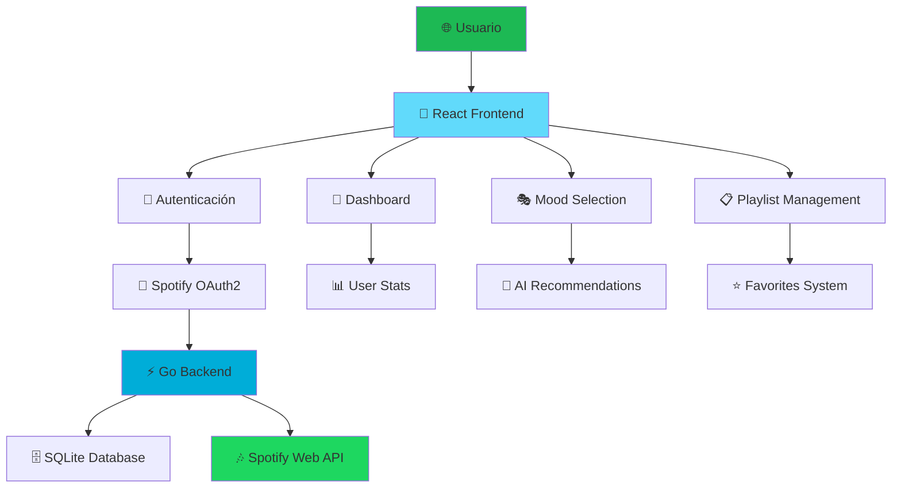

# 🎵 SpotifyMood - Tu Música, Tu Estado de Ánimo

<div align="center">
  

### *Descubre la banda sonora perfecta para cada momento de tu vida*

[](https://golang.org/)
[](https://reactjs.org/)
[](https://developer.spotify.com/)
[](https://www.typescriptlang.org/)
[](https://tailwindcss.com/)
</div>

---

## 🌟 ¿Qué es SpotifyMood?

**SpotifyMood** es una aplicación revolucionaria que conecta tus emociones con la música perfecta. Utilizando la potencia de la API de Spotify y algoritmos inteligentes de recomendación, transformamos tu estado de ánimo en experiencias musicales únicas y personalizadas.

### ✨ La Magia Detrás del Código

> *"La música es el lenguaje universal de las emociones"* - Y nosotros somos los traductores.

---

## 👥 Equipo de Desarrollo

<table align="center">
  <tr>
    <td align="center">
      <br>
      <strong>José Hernández</strong>
      <br>
      <em>Backend Architect</em>
      <br>
      🔧 Go • Fiber • OAuth2 • APIs
    </td>
    <td align="center">
      <br>
      <strong>Santos Chavarría</strong>
      <br>
      <em>Frontend Wizard</em>
      <br>
      ⚡ React • TypeScript • UI/UX
    </td>
  </tr>
</table>

---

## 🚀 Características Principales

### 🎭 **Estados de Ánimo Inteligentes**
- **8 Moods Únicos**: Happy, Chill, Focus, Workout, Sad, Party, Romantic, Study
- **Recomendaciones IA**: Algoritmos que aprenden de tus gustos musicales
- **Personalización Total**: Cada mood se adapta a tu perfil musical

### 🎵 **Gestión de Playlists**
- **Sincronización Spotify**: Acceso completo a tus playlists personales
- **Sistema de Favoritos**: Marca y organiza tus playlists preferidas
- **Búsqueda Avanzada**: Encuentra música por artista, álbum o género

### 🔐 **Autenticación Segura**
- **OAuth2 con Spotify**: Login seguro y sin contraseñas
- **JWT Tokens**: Sesiones seguras y persistentes
- **Protección de Datos**: Tu información siempre protegida

### 🎨 **Interfaz Moderna**
- **Diseño Responsivo**: Perfecto en móvil, tablet y desktop
- **Tema Oscuro**: Inspirado en Spotify con gradientes vibrantes
- **Animaciones Fluidas**: Micro-interacciones que deleitan
- **Glass Morphism**: Efectos visuales modernos y elegantes

---

## 🏗️ Arquitectura del Sistema

### 📊 **Flujo de la Aplicación**



### 🔄 **Flujo Backend (Go + Fiber)**

#### 🎯 **Arquitectura de Microservicios**
```
📦 Backend Structure
├── 🚀 main.go              # Servidor principal y configuración
├── 🛣️  routes.go           # Definición de rutas API
├── 🔐 auth.go              # Sistema de autenticación OAuth2
├── 📊 models.go            # Modelos de datos y estructuras
├── 🗄️  database.go         # Gestión de base de datos SQLite
├── 🎵 handlers.go          # Lógica de negocio y controladores
└── 📋 go.mod               # Dependencias del proyecto
```

#### 🔄 **Flujo de Autenticación**
1. **Inicio de Sesión** → Usuario solicita login con Spotify
2. **Redirección OAuth2** → Backend genera URL de autorización
3. **Callback Spotify** → Spotify devuelve código de autorización
4. **Intercambio de Tokens** → Backend obtiene access_token y refresh_token
5. **Perfil de Usuario** → Obtiene información del usuario desde Spotify
6. **JWT Generation** → Crea token JWT para sesiones del frontend
7. **Persistencia** → Guarda usuario y tokens en base de datos

#### 🎵 **Flujo de Recomendaciones**
1. **Selección de Mood** → Usuario elige estado de ánimo
2. **Mapeo de Atributos** → Backend mapea mood a parámetros musicales
3. **Spotify Recommendations API** → Solicita recomendaciones con parámetros específicos
4. **Procesamiento** → Filtra y organiza resultados
5. **Respuesta JSON** → Envía tracks recomendados al frontend

### ⚡ **Flujo Frontend (React + TypeScript)**

#### 🎨 **Arquitectura de Componentes**
```
📦 Frontend Structure
├── 🏠 pages/               # Páginas principales de la aplicación
│   ├── HomePage.tsx        # Landing page con hero section
│   ├── LoginPage.tsx       # Página de autenticación
│   ├── DashboardPage.tsx   # Panel principal del usuario
│   ├── MoodPage.tsx        # Selección de moods y recomendaciones
│   └── PlaylistsPage.tsx   # Gestión de playlists
├── 🧩 components/          # Componentes reutilizables
│   ├── Navbar.tsx          # Navegación principal
│   ├── MoodCard.tsx        # Tarjetas de estados de ánimo
│   ├── PlaylistCard.tsx    # Tarjetas de playlists
│   ├── TrackCard.tsx       # Tarjetas de canciones
│   └── LoadingSpinner.tsx  # Indicadores de carga
├── 🔄 contexts/            # Gestión de estado global
│   ├── AuthContext.tsx     # Estado de autenticación
│   └── SpotifyContext.tsx  # Estado de datos de Spotify
└── 🎨 styles/              # Estilos y temas
```

#### 🔄 **Flujo de Estado (Context API)**
1. **AuthContext** → Maneja autenticación, tokens y perfil de usuario
2. **SpotifyContext** → Gestiona playlists, moods, favoritos y recomendaciones
3. **Persistencia Local** → Tokens guardados en localStorage
4. **Sincronización** → Estado sincronizado con backend via API calls

#### 🎭 **Flujo de Experiencia de Usuario**
1. **Landing Page** → Presentación atractiva con call-to-action
2. **Autenticación** → Login fluido con Spotify OAuth2
3. **Dashboard** → Vista general con estadísticas y accesos rápidos
4. **Mood Selection** → Interfaz intuitiva para elegir estados de ánimo
5. **Recomendaciones** → Lista de tracks con preview y enlaces a Spotify
6. **Playlist Management** → Gestión completa de playlists con favoritos

---

## 🛠️ Tecnologías Utilizadas

### 🔧 **Backend Stack**
- **Go 1.21+** - Lenguaje de programación principal
- **Fiber v2** - Framework web ultrarrápido y expresivo
- **GORM** - ORM elegante para Go
- **SQLite** - Base de datos ligera y eficiente
- **JWT-Go** - Manejo de tokens de autenticación
- **Spotify Web API** - Integración musical completa

### ⚡ **Frontend Stack**
- **React 18** - Biblioteca de UI con hooks modernos
- **TypeScript** - Tipado estático para mayor robustez
- **Tailwind CSS** - Framework de utilidades CSS
- **React Router** - Navegación SPA fluida
- **Lucide React** - Iconografía moderna y consistente
- **Context API** - Gestión de estado sin librerías externas

---

## 🚀 Instalación y Configuración

### 📋 **Prerrequisitos**
- Go 1.21 o superior
- Node.js 18 o superior
- Cuenta de desarrollador en Spotify
- Git

### 🔧 **Configuración del Backend**

```bash
# 1. Clonar el repositorio
git clone <repository-url>
cd spotify-mood-app

# 2. Configurar el backend
cd backend
go mod tidy

# 3. Configurar variables de entorno
cp .env.example .env
# Editar .env con tus credenciales de Spotify

# 4. Ejecutar el servidor
go run .
```

### ⚡ **Configuración del Frontend**

```bash
# 1. Instalar dependencias
npm install

# 2. Ejecutar en modo desarrollo
npm run dev
```

### 🎵 **Configuración de Spotify API**

1. Ve a [Spotify Developer Dashboard](https://developer.spotify.com/dashboard)
2. Crea una nueva aplicación
3. Configura las Redirect URIs:
    - `http://localhost:3000/api/v1/auth/spotify/callback`
4. Copia Client ID y Client Secret al archivo `.env`

---

## 📱 **Capturas de Pantalla**

<div align="center">
  
  
</div>

---

## 🎯 **Roadmap Futuro**

- [ ] 🤖 **Machine Learning** - Recomendaciones más inteligentes
- [ ] 👥 **Social Features** - Compartir moods con amigos
- [ ] 📊 **Analytics** - Estadísticas detalladas de escucha
- [ ] 🎨 **Temas Personalizados** - Customización visual
- [ ] 📱 **App Móvil** - Versión nativa para iOS/Android
- [ ] 🔊 **Audio Features** - Análisis de características musicales
- [ ] 🎪 **Eventos** - Integración con conciertos y eventos

---

## 🤝 **Contribuciones**

¡Las contribuciones son bienvenidas! Si tienes ideas para mejorar SpotifyMood:

1. Fork el proyecto
2. Crea una rama para tu feature (`git checkout -b feature/AmazingFeature`)
3. Commit tus cambios (`git commit -m 'Add some AmazingFeature'`)
4. Push a la rama (`git push origin feature/AmazingFeature`)
5. Abre un Pull Request

---

## 📄 **Licencia**

Este proyecto está bajo la Licencia MIT. Ver `LICENSE` para más detalles.

---

## 🎵 **Agradecimientos**

- **Spotify** por su increíble API y ecosistema musical
- **La comunidad de Go** por las herramientas y librerías
- **React Team** por hacer el desarrollo frontend tan elegante
- **Todos los músicos** que hacen posible que la música sea universal

---

<div align="center">
  <h3>🎶 Hecho con ❤️ y mucha música 🎶</h3>
  <p><em>"Donde la tecnología se encuentra con la pasión musical"</em></p>

[](https://github.com/username/spotify-mood)
[](https://twitter.com/username)
</div>